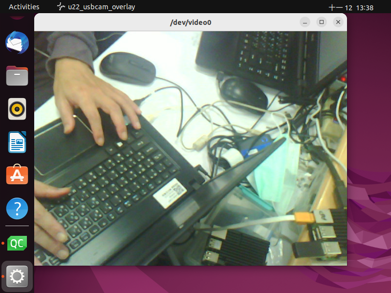
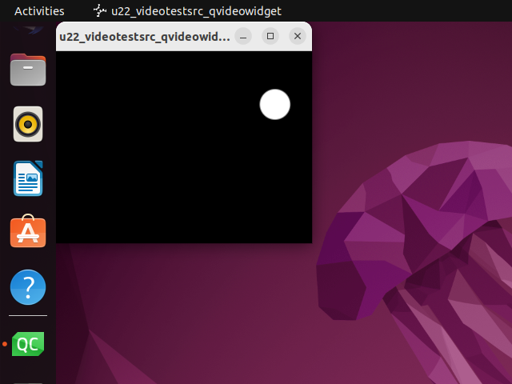
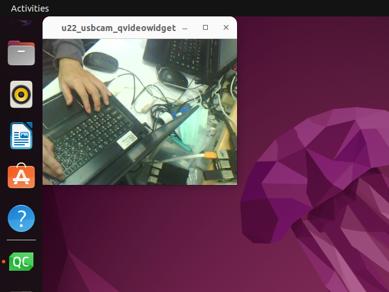

# In progress
# ubuntu_22_usb_camera_qt5_gstreamer
Display USB camera on ubuntu22 with Qt  
OS: Ubuntu 22.04.3  
Qt Creator 4.11.1, Qt 5.14.1, GCC 5.3.1  
 
There are 2 way to use:  
(1) overlay  
(2) QVideoWidget   
From QT5.12.2, there is a quick call.  
QMediaplayer->setMedia(QUrl("gst-pipeline: videotestsrc !  videoconvert ! xvimagesink name=\\\"qtvideosink\\\""));  
 
Overlay and USB camera  
 
 
QVideoWidget and videotestsrc  
 
 
QVideoWidget and USB camera  
 
 
# Just run executable file
sudo apt-get update  
sudo apt-get install libqt5widgets5  
sudo apt-get install libqt5multimedia5 libqt5multimediawidgets5  
sudo apt-get install libqt5multimedia5-plugins  

# Compile the source code
sudo apt-get update  
 
sudo apt-get install build-essential  
sudo apt-get install libfontconfig1  
sudo apt-get install mesa-common-dev  
sudo apt-get install libglu1-mesa-dev  
sudo apt-get install libx11-dev libxext-dev libxtst-dev  
 
download and install qt-opensource-linux-x64-5.14.2.run  
 
sudo apt-get install libqt5widgets5  
sudo apt-get install libqt5multimedia5 libqt5multimediawidgets5  
sudo apt-get install libqt5multimedia5-plugins  
 
sudo apt-get install gstreamer1.0-plugins-*  
sudo apt-get install libgstreamer1.0-dev  
sudo apt-get install libqt5gstreamer-dev  
 
